# Aperture v5 Frontend Redesign — Implementation Plan

> **For agentic workers:** REQUIRED: Use the `subagent-driven-development` agent (recommended) or `executing-plans` agent to implement this plan task-by-task. Steps use checkbox (`- [ ]`) syntax for tracking.

**Goal:** Redesign the entire Aperture frontend to match the v5 design spec (docs/design-preview-v5.html), replacing Inter with new typography, adding zinc default theme, building a reusable UI component library, restyling all 19 existing Vue pages, and establishing full code quality tooling (PHPStan Level 8, Rector, ESLint, Prettier, Vitest 100% coverage, Playwright E2E on desktop/mobile/tablet).

**Architecture:** Layered approach — Phase A builds the design system and reusable components, Phase B reskins the captive portal (Blade), Phase C reskins the user portal, Phase D reskins all admin pages, Phase E sets up quality tooling, Phase F adds testable IDs and comprehensive test coverage, Phase G runs a quality review via separate subagent. Each phase produces working, testable software. All styling uses CSS custom properties consumed by Tailwind v4 utility classes.

**Tech Stack:** Vue 3 Composition API, Inertia.js, Tailwind CSS v4 (`@tailwindcss/vite`), self-hosted woff2 fonts, CSS custom properties for theming.

**Design Reference:** `docs/design-preview-v5.html` (9 sections), mockups in `docs/mockups/`

---

## File Structure

### New files to create
```
resources/fonts/space-grotesk/SpaceGrotesk-Variable.woff2
resources/fonts/space-grotesk/space-grotesk.css
resources/fonts/plus-jakarta-sans/PlusJakartaSans-Variable.woff2
resources/fonts/plus-jakarta-sans/plus-jakarta-sans.css
resources/fonts/jetbrains-mono/JetBrainsMono-Regular.woff2
resources/fonts/jetbrains-mono/jetbrains-mono.css
resources/css/themes/default.css
resources/js/Components/UI/StatusPill.vue
resources/js/Components/UI/DataTable.vue
resources/js/Components/UI/Pagination.vue
resources/js/Components/UI/FormField.vue
resources/js/Components/UI/MetadataStrip.vue
resources/js/Components/UI/StatCard.vue
resources/js/Components/UI/EmptyState.vue
resources/js/Components/UI/AlertBanner.vue
resources/js/Components/UI/SectionHeader.vue
resources/js/Components/UI/ConfigBlock.vue
resources/js/Components/UI/ProgressBar.vue
resources/js/Components/Admin/SettingsNav.vue
```

### Existing files to modify
```
resources/css/app.css                              — typography + @theme
resources/js/Layouts/AdminLayout.vue               — header, sidebar integration, responsive flex
resources/js/Layouts/PortalLayout.vue               — mobile refinement, glow effects
resources/js/Components/Admin/Sidebar.vue           — 172px, responsive horizontal nav
resources/js/Components/Admin/GlobalSearch.vue       — hide at ≤640px
resources/views/captive/login.blade.php             — v5 captive design
resources/views/captive/interstitial.blade.php      — v5 step-by-step activating design
resources/views/layouts/captive.blade.php           — v5 font + base styles
resources/js/Pages/Portal/Dashboard.vue             — v5 portal layout
resources/js/Components/BlockGrid.vue               — responsive grid sizing
resources/js/Components/Blocks/*.vue (6 files)      — card styling consistency
resources/js/Pages/Admin/Dashboard.vue              — hero stat, DHCP pools, port errors, user table
resources/js/Pages/Admin/Users/Index.vue            — DataTable, StatusPill, Pagination
resources/js/Pages/Admin/Users/Show.vue             — MetadataStrip, bandwidth chart, IP table
resources/js/Pages/Admin/Ips/Index.vue              — DataTable, Pagination (if not already there)
resources/js/Pages/Admin/Ips/Show.vue               — MetadataStrip, related users, port info
resources/js/Pages/Admin/Ips/Create.vue             — FormField components
resources/js/Pages/Admin/Ports/Index.vue            — DataTable, status pills
resources/js/Pages/Admin/Ports/Show.vue             — MetadataStrip, ConfigBlock, stats
resources/js/Pages/Admin/Dhcp/Index.vue             — StatCards, ProgressBar
resources/js/Pages/Admin/Dhcp/Leases.vue            — DataTable, Pagination
resources/js/Pages/Admin/Stats/Index.vue            — StatCards, chart placeholders
resources/js/Pages/Admin/Stats/Bandwidth.vue        — chart with legend
resources/js/Pages/Admin/Content/Index.vue          — DataTable, empty state, builder layout
resources/js/Pages/Admin/Settings/Integrations.vue  — SettingsNav, FormField
resources/js/Pages/Admin/Settings/Theme.vue         — SettingsNav, theme picker with preview
resources/js/Pages/Admin/Settings/Event.vue         — SettingsNav, FormField
resources/js/Pages/Admin/Settings/Portal.vue        — SettingsNav, FormField
resources/js/Pages/Portal/Ipv6.vue                  — FormField, card styling
```

---

## Phase A: Foundation & Design System

### A1: Typography System [size: S]

**Files:**
- Create: `resources/fonts/space-grotesk/space-grotesk.css`
- Create: `resources/fonts/plus-jakarta-sans/plus-jakarta-sans.css`
- Create: `resources/fonts/jetbrains-mono/jetbrains-mono.css`
- Modify: `resources/css/app.css`

- [ ] **Step 1: Download font woff2 files**

```bash
mkdir -p resources/fonts/space-grotesk resources/fonts/plus-jakarta-sans resources/fonts/jetbrains-mono
curl -L -o resources/fonts/space-grotesk/SpaceGrotesk-Variable.woff2 \
  "https://fonts.gstatic.com/s/spacegrotesk/v16/V8mDoQDjQSkFtoMM3T6r8E7mPb54C_k3HqUtEw.woff2"
curl -L -o resources/fonts/plus-jakarta-sans/PlusJakartaSans-Variable.woff2 \
  "https://fonts.gstatic.com/s/plusjakartasans/v8/LDIoaomQNQcsA88c7O9yZ4KMCoOg4Ko20yygg_vbd-E.woff2"
curl -L -o resources/fonts/jetbrains-mono/JetBrainsMono-Regular.woff2 \
  "https://fonts.gstatic.com/s/jetbrainsmono/v18/tDbY2o-flEEny0FZhsfKu5WU4zr3E_BX0PnT8RD8yKxjPVmUsalk.woff2"
```

- [ ] **Step 2: Create @font-face CSS files**

`resources/fonts/space-grotesk/space-grotesk.css`:
```css
@font-face {
  font-family: "Space Grotesk";
  font-style: normal;
  font-weight: 300 700;
  font-display: swap;
  src: url("SpaceGrotesk-Variable.woff2") format("woff2");
}
```

`resources/fonts/plus-jakarta-sans/plus-jakarta-sans.css`:
```css
@font-face {
  font-family: "Plus Jakarta Sans";
  font-style: normal;
  font-weight: 200 800;
  font-display: swap;
  src: url("PlusJakartaSans-Variable.woff2") format("woff2");
}
```

`resources/fonts/jetbrains-mono/jetbrains-mono.css`:
```css
@font-face {
  font-family: "JetBrains Mono";
  font-style: normal;
  font-weight: 400;
  font-display: swap;
  src: url("JetBrainsMono-Regular.woff2") format("woff2");
}
```

- [ ] **Step 3: Update `resources/css/app.css`**

Replace the entire file with:
```css
@import "tailwindcss";
@import "../fonts/space-grotesk/space-grotesk.css";
@import "../fonts/plus-jakarta-sans/plus-jakarta-sans.css";
@import "../fonts/jetbrains-mono/jetbrains-mono.css";
@import "./themes/default.css";
@import "./themes/cool-neon.css";
@import "./themes/warm-neon.css";
@import "./themes/matrix.css";
@import "./themes/amber-glow.css";

@theme {
  --font-heading: "Space Grotesk", ui-sans-serif, system-ui, sans-serif;
  --font-body: "Plus Jakarta Sans", ui-sans-serif, system-ui, sans-serif;
  --font-mono: "JetBrains Mono", ui-monospace, monospace;
}

@layer base {
  html {
    font-family: var(--font-body);
  }
  h1, h2, h3, h4, h5, h6 {
    font-family: var(--font-heading);
  }
  code, pre, kbd, samp {
    font-family: var(--font-mono);
  }
}
```

- [ ] **Step 4: Verify build**

```bash
npm run build 2>&1 | tail -5
```
Expected: Build completes without errors.

- [ ] **Step 5: Commit**

```bash
git add resources/fonts/space-grotesk resources/fonts/plus-jakarta-sans resources/fonts/jetbrains-mono resources/css/app.css
git commit -m "feat: replace Inter with Space Grotesk, Plus Jakarta Sans, JetBrains Mono"
```

---

### A2: Default Zinc Theme [size: S]

**Files:**
- Create: `resources/css/themes/default.css`

- [ ] **Step 1: Create `resources/css/themes/default.css`**

```css
/* Default — Zinc (warm gray) + Indigo/Rose accents (v5 spec) */

[data-theme="default"] {
    --color-primary: #6366f1;
    --color-primary-hover: #4f46e5;
    --color-accent: #e11d48;
    --color-accent-hover: #be123c;
    --color-success: #059669;
    --color-warning: #d97706;
    --color-danger: #dc2626;
    --color-info: #6366f1;
    --color-glow: rgba(99, 102, 241, 0.35);

    /* Light mode — warm zinc grays */
    --color-bg: #faf9f7;
    --color-surface: #ffffff;
    --color-surface-hover: #f4f4f5;
    --color-text: #1a1917;
    --color-text-secondary: #52525b;
    --color-text-muted: #6b6a60;
    --color-border: #e4e4e7;
    --color-border-hover: #d4d4d8;
    --color-input-bg: #ffffff;
}

[data-theme="default"][data-mode="dark"] {
    --color-primary: #818cf8;
    --color-primary-hover: #6366f1;
    --color-accent: #fb7185;
    --color-accent-hover: #f43f5e;
    --color-success: #34d399;
    --color-warning: #fbbf24;
    --color-danger: #f87171;
    --color-info: #818cf8;

    --color-bg: #1a1a1e;
    --color-surface: #252528;
    --color-surface-hover: #37373c;
    --color-text: #fafaf9;
    --color-text-secondary: #b8b7b0;
    --color-text-muted: #9a9990;
    --color-border: #3d3d42;
    --color-border-hover: #56565c;
    --color-input-bg: #2a2a2e;
    --color-glow: rgba(129, 140, 248, 0.25);
}
```

Note: These values match the v5 wireframe exactly (`--bg:#1a1a1e`, `--surface:#252528`, etc.).

- [ ] **Step 2: Verify build**

```bash
npm run build 2>&1 | tail -3
```

- [ ] **Step 3: Commit**

```bash
git add resources/css/themes/default.css
git commit -m "feat: add zinc-based default theme matching v5 spec colors"
```

---

### A3: Sidebar Responsive Collapse [size: M]

**Files:**
- Modify: `resources/js/Components/Admin/Sidebar.vue`
- Modify: `resources/js/Layouts/AdminLayout.vue`

- [ ] **Step 1: Rewrite `resources/js/Components/Admin/Sidebar.vue`**

Replace the entire file. Key changes: 172px fixed width (was w-56/224px), `Link` instead of `<a>` (Inertia navigation), responsive breakpoint at 1024px switches to horizontal scrollable nav, removes manual collapse toggle.

```vue
<script setup>
import { ref, computed, onMounted, onUnmounted } from 'vue';
import { Link, usePage } from '@inertiajs/vue3';

const currentUrl = computed(() => usePage().url);
const isDesktop = ref(true);

const navItems = [
    { label: 'Dashboard', href: '/admin', icon: '📊' },
    { label: 'Users', href: '/admin/users', icon: '👥' },
    { label: 'IP Addresses', href: '/admin/ips', icon: '🌐' },
    { label: 'Ports', href: '/admin/ports', icon: '🔌' },
    { label: 'DHCP', href: '/admin/dhcp', icon: '📡' },
    { label: 'Stats', href: '/admin/stats', icon: '📈' },
    { label: 'Content', href: '/admin/content', icon: '📝' },
    { label: 'Settings', href: '/admin/settings/integrations', icon: '⚙️' },
];

function isActive(href) {
    if (href === '/admin') return currentUrl.value === '/admin';
    return currentUrl.value.startsWith(href);
}

function checkBreakpoint() {
    isDesktop.value = window.innerWidth > 1024;
}

onMounted(() => {
    checkBreakpoint();
    window.addEventListener('resize', checkBreakpoint);
});

onUnmounted(() => {
    window.removeEventListener('resize', checkBreakpoint);
});
</script>

<template>
    <!-- Desktop: 172px vertical sidebar -->
    <aside v-if="isDesktop" class="flex w-[172px] shrink-0 flex-col border-r border-[var(--color-border)] bg-[var(--color-surface)]">
        <div class="border-b border-[var(--color-border)] px-4 py-3">
            <span class="font-heading text-sm font-bold text-[var(--color-text)]">Admin</span>
        </div>
        <nav class="flex-1 overflow-y-auto p-2">
            <Link v-for="item in navItems" :key="item.href" :href="item.href"
                :class="isActive(item.href)
                    ? 'bg-[var(--color-primary)]/10 text-[var(--color-primary)]'
                    : 'text-[var(--color-text-secondary)] hover:bg-[var(--color-surface-hover)] hover:text-[var(--color-text)]'"
                class="mb-0.5 flex items-center gap-2 rounded-lg px-3 py-1.5 text-sm transition-colors">
                <span class="text-xs">{{ item.icon }}</span>
                <span>{{ item.label }}</span>
            </Link>
        </nav>
    </aside>

    <!-- Tablet/mobile: horizontal scrollable nav -->
    <nav v-else class="flex items-center gap-1 overflow-x-auto border-b border-[var(--color-border)] bg-[var(--color-surface)] px-4 py-2">
        <Link v-for="item in navItems" :key="item.href" :href="item.href"
            :class="isActive(item.href)
                ? 'bg-[var(--color-primary)]/10 text-[var(--color-primary)]'
                : 'text-[var(--color-text-secondary)] hover:bg-[var(--color-surface-hover)] hover:text-[var(--color-text)]'"
            class="flex shrink-0 items-center gap-1.5 rounded-lg px-3 py-1.5 text-sm transition-colors">
            <span class="text-xs">{{ item.icon }}</span>
            <span>{{ item.label }}</span>
        </Link>
    </nav>
</template>
```

- [ ] **Step 2: Update `resources/js/Layouts/AdminLayout.vue` template**

Replace the `<template>` section. Key change: move header outside the flex row so sidebar+main sit below header, wrap Sidebar+main in an inner flex that handles both orientations.

```vue
<template>
    <div class="flex min-h-screen flex-col bg-[var(--color-bg)]">
        <!-- Top bar -->
        <header class="sticky top-0 z-40 flex h-14 items-center justify-between border-b border-[var(--color-border)] bg-[var(--color-surface)]/80 backdrop-blur-sm px-6">
            <div class="flex items-center gap-4">
                <AppLogo />
                <slot name="breadcrumbs" />
            </div>

            <div class="flex items-center gap-3">
                <GlobalSearch class="hidden sm:block" />
                <ThemeToggle />

                <div v-if="page.props.auth.user" class="flex items-center gap-3">
                    <span class="hidden sm:inline text-sm text-[var(--color-text-secondary)]">
                        {{ page.props.auth.user.nickname }}
                    </span>
                    <Link
                        :href="route('logout')"
                        class="text-sm text-[var(--color-text-muted)] hover:text-[var(--color-text)] transition-colors"
                    >
                        Logout
                    </Link>
                </div>
            </div>
        </header>

        <!-- Sidebar + Content -->
        <div class="flex flex-1">
            <Sidebar />
            <main class="min-w-0 flex-1 p-6">
                <slot />
            </main>
        </div>
    </div>
</template>
```

Note: The `<script setup>` block is unchanged — it already imports all needed components.

- [ ] **Step 3: Verify build and visual check**

```bash
npm run build
```
Resize browser below 1024px → sidebar becomes horizontal scrollable nav. Above 1024px → 172px vertical sidebar. GlobalSearch hidden at ≤640px.

- [ ] **Step 4: Commit**

```bash
git add resources/js/Components/Admin/Sidebar.vue resources/js/Layouts/AdminLayout.vue
git commit -m "feat: responsive sidebar — 172px desktop, horizontal nav ≤1024px"
```

---

### A4: StatusPill Component [size: S]

**Files:**
- Create: `resources/js/Components/UI/StatusPill.vue`

- [ ] **Step 1: Create `resources/js/Components/UI/StatusPill.vue`**

```vue
<script setup>
const props = defineProps({
    status: {
        type: String,
        required: true,
        validator: (v) => ['success', 'danger', 'warning', 'info', 'neutral'].includes(v),
    },
    label: { type: String, required: true },
});

const config = {
    success: { icon: '✓', bg: 'bg-[var(--color-success)]/10', text: 'text-[var(--color-success)]', border: 'border-[var(--color-success)]/20' },
    danger:  { icon: '✕', bg: 'bg-[var(--color-danger)]/10',  text: 'text-[var(--color-danger)]',  border: 'border-[var(--color-danger)]/20' },
    warning: { icon: '▲', bg: 'bg-[var(--color-warning)]/10', text: 'text-[var(--color-warning)]', border: 'border-[var(--color-warning)]/20' },
    info:    { icon: '●', bg: 'bg-[var(--color-primary)]/10', text: 'text-[var(--color-primary)]', border: 'border-[var(--color-primary)]/20' },
    neutral: { icon: '—', bg: 'bg-[var(--color-text-muted)]/10', text: 'text-[var(--color-text-muted)]', border: 'border-[var(--color-text-muted)]/20' },
};

const c = config[props.status];
</script>

<template>
    <span :class="[c.bg, c.text, c.border]"
        class="inline-flex items-center gap-1 rounded-full border px-2.5 py-0.5 text-xs font-semibold">
        <span class="font-mono text-[10px] leading-none" aria-hidden="true">{{ c.icon }}</span>
        {{ label }}
    </span>
</template>
```

Uses theme CSS vars so pills adapt to all 5 themes. `::before` icon pattern from spec rendered as inline span. The `aria-hidden="true"` on the icon ensures screen readers read only the label.

- [ ] **Step 2: Commit**

```bash
git add resources/js/Components/UI/StatusPill.vue
git commit -m "feat: add StatusPill with colorblind-accessible icons"
```

---

### A5: DataTable Component [size: M]

**Files:**
- Create: `resources/js/Components/UI/DataTable.vue`

- [ ] **Step 1: Create `resources/js/Components/UI/DataTable.vue`**

```vue
<script setup>
import { Link } from '@inertiajs/vue3';

defineProps({
    columns: {
        type: Array,
        required: true,
        /* Array<{ key: string, label: string, class?: string, srOnly?: boolean }> */
    },
    rows: { type: Array, required: true },
    clickable: { type: Boolean, default: false },
    rowHref: { type: Function, default: null },
    emptyMessage: { type: String, default: 'No records found.' },
    emptyIcon: { type: String, default: '' },
});
</script>

<template>
    <div class="overflow-x-auto rounded-lg border border-[var(--color-border)]">
        <table class="w-full text-sm">
            <thead>
                <tr class="border-b-2 border-[var(--color-border)] bg-[var(--color-surface)]">
                    <th v-for="col in columns" :key="col.key"
                        :class="[col.class, col.srOnly ? 'sr-only' : '']"
                        class="px-4 py-2.5 text-left text-[10px] font-bold uppercase tracking-wider text-[var(--color-text-muted)]">
                        {{ col.label }}
                    </th>
                </tr>
            </thead>
            <tbody>
                <tr v-if="rows.length === 0">
                    <td :colspan="columns.length" class="px-4 py-12 text-center text-[var(--color-text-muted)]">
                        {{ emptyMessage }}
                    </td>
                </tr>
                <tr v-for="(row, i) in rows" :key="row.id ?? i"
                    :class="[
                        'border-b border-[var(--color-border)] transition-colors last:border-b-0',
                        clickable ? 'cursor-pointer hover:bg-[var(--color-surface-hover)] hover:border-l-2 hover:border-l-[var(--color-primary)] hover:pl-[2px]' : '',
                    ]"
                    @click="clickable && rowHref ? $inertia?.visit(rowHref(row)) : null">
                    <slot name="row" :row="row" :index="i" />
                </tr>
            </tbody>
        </table>
    </div>
</template>
```

Key features per spec:
- `border-b-2` on thead (matches `.tbl th` 2px border)
- 10px uppercase bold muted headers
- Clickable rows: hover bg + 2px left border accent in primary color
- Empty state message
- Scoped slot for row content

- [ ] **Step 2: Verify component renders**

Create a temporary test page or check in vue devtools after build:
```bash
npm run build
```

- [ ] **Step 3: Commit**

```bash
git add resources/js/Components/UI/DataTable.vue
git commit -m "feat: add DataTable with clickable rows and left-border hover accent"
```

---

### A6: Pagination Component [size: S]

**Files:**
- Create: `resources/js/Components/UI/Pagination.vue`

- [ ] **Step 1: Create `resources/js/Components/UI/Pagination.vue`**

```vue
<script setup>
import { Link } from '@inertiajs/vue3';

defineProps({
    paginator: {
        type: Object,
        required: true,
        /* Laravel paginator JSON: { current_page, last_page, from, to, total, links[] } */
    },
});
</script>

<template>
    <div v-if="paginator.last_page > 1" class="flex flex-wrap items-center justify-between gap-4 border-t border-[var(--color-border)] pt-3 text-sm">
        <span class="text-[11px] text-[var(--color-text-muted)]">
            Showing {{ paginator.from }}–{{ paginator.to }} of {{ paginator.total }}
        </span>
        <div class="flex items-center gap-1">
            <template v-for="link in paginator.links" :key="link.label">
                <Link v-if="link.url"
                    :href="link.url"
                    :class="link.active
                        ? 'bg-[var(--color-primary)]/10 border-[var(--color-primary)] text-[var(--color-primary)] font-semibold'
                        : 'border-[var(--color-border)] text-[var(--color-text-secondary)] hover:border-[var(--color-primary)] hover:text-[var(--color-primary)]'"
                    class="rounded-md border px-2.5 py-1 text-[11px] transition-colors"
                    preserve-state
                    v-html="link.label" />
                <span v-else
                    class="rounded-md px-2.5 py-1 text-[11px] text-[var(--color-text-muted)] opacity-40"
                    v-html="link.label" />
            </template>
        </div>
    </div>
</template>
```

Matches v5 spec: "Showing 1-25 of N" on left, numbered page buttons on right, active page highlighted with primary bg/border, disabled pages 40% opacity.

- [ ] **Step 2: Commit**

```bash
git add resources/js/Components/UI/Pagination.vue
git commit -m "feat: add Pagination with range display and numbered buttons"
```

---

### A7: FormField Component [size: S]

**Files:**
- Create: `resources/js/Components/UI/FormField.vue`

- [ ] **Step 1: Create `resources/js/Components/UI/FormField.vue`**

```vue
<script setup>
defineProps({
    label: { type: String, required: true },
    name: { type: String, required: true },
    required: { type: Boolean, default: false },
    error: { type: String, default: '' },
});
</script>

<template>
    <div class="space-y-1.5">
        <label :for="name" class="block text-sm font-semibold text-[var(--color-text)]">
            {{ label }}
            <span v-if="required" class="text-[var(--color-danger)]" aria-label="required">*</span>
            <span v-else class="ml-1 text-xs font-normal text-[var(--color-text-muted)]">(optional)</span>
        </label>
        <slot />
        <p v-if="error" class="text-xs text-[var(--color-danger)]">{{ error }}</p>
    </div>
</template>
```

Spec: required fields → red `*`, optional fields → "(optional)" label text.

- [ ] **Step 2: Commit**

```bash
git add resources/js/Components/UI/FormField.vue
git commit -m "feat: add FormField with required/optional indicators"
```

---

### A8: MetadataStrip Component [size: S]

**Files:**
- Create: `resources/js/Components/UI/MetadataStrip.vue`

- [ ] **Step 1: Create `resources/js/Components/UI/MetadataStrip.vue`**

```vue
<script setup>
defineProps({
    items: {
        type: Array,
        required: true,
        /* Array<{ label: string, value: string|number, mono?: boolean, large?: boolean }> */
    },
});
</script>

<template>
    <div class="flex flex-wrap gap-x-7 gap-y-2 border-b-2 border-[var(--color-border)] pb-3.5 mb-3.5">
        <div v-for="item in items" :key="item.label" class="flex flex-col">
            <span class="text-[10px] font-bold uppercase tracking-wider text-[var(--color-text-muted)]">{{ item.label }}</span>
            <span :class="[item.mono ? 'font-mono' : '', item.large ? 'text-sm font-semibold' : 'text-[13px]']" class="text-[var(--color-text)]">
                <slot :name="item.label" :item="item">{{ item.value }}</slot>
            </span>
        </div>
    </div>
</template>
```

Matches `.detail-strip` from v5 wireframe: flex with 28px (gap-x-7) between items, 2px bottom border, uppercase 10px labels, wraps on ≤1024px (flex-wrap).

- [ ] **Step 2: Commit**

```bash
git add resources/js/Components/UI/MetadataStrip.vue
git commit -m "feat: add MetadataStrip for detail page headers"
```

---

### A9: StatCard Component [size: S]

**Files:**
- Create: `resources/js/Components/UI/StatCard.vue`

- [ ] **Step 1: Create `resources/js/Components/UI/StatCard.vue`**

```vue
<script setup>
defineProps({
    label: { type: String, required: true },
    value: { type: [String, Number], required: true },
    color: { type: String, default: 'text' },
    hero: { type: Boolean, default: false },
    accentBorder: { type: String, default: '' },
});

const colorMap = {
    text: 'text-[var(--color-text)]',
    primary: 'text-[var(--color-primary)]',
    accent: 'text-[var(--color-accent)]',
    success: 'text-[var(--color-success)]',
    danger: 'text-[var(--color-danger)]',
    warning: 'text-[var(--color-warning)]',
};
</script>

<template>
    <div :class="[
        hero ? 'bg-[var(--color-success)]/5 border-[var(--color-success)]/15' : 'bg-[var(--color-surface)]',
        accentBorder ? 'border-l-[3px]' : '',
    ]"
        :style="accentBorder ? `border-left-color: var(--color-${accentBorder})` : ''"
        class="rounded-xl border border-[var(--color-border)] p-5 transition-colors hover:border-[var(--color-border-hover)]">
        <p class="text-[11px] font-bold uppercase tracking-wider text-[var(--color-text-muted)]">{{ label }}</p>
        <p :class="[colorMap[color] ?? colorMap.text, hero ? 'text-[40px] leading-none tracking-tight' : 'text-2xl']"
            class="mt-1 font-heading font-bold">
            {{ value }}
        </p>
        <slot />
    </div>
</template>
```

Supports: hero variant (green tinted bg like .card-hero), accent-border left (like .card-accent), themed color value, heading font for numbers.

- [ ] **Step 2: Commit**

```bash
git add resources/js/Components/UI/StatCard.vue
git commit -m "feat: add StatCard with hero and accent-border variants"
```

---

### A10: Remaining UI Components [size: S]

**Files:**
- Create: `resources/js/Components/UI/EmptyState.vue`
- Create: `resources/js/Components/UI/AlertBanner.vue`
- Create: `resources/js/Components/UI/SectionHeader.vue`
- Create: `resources/js/Components/UI/ConfigBlock.vue`
- Create: `resources/js/Components/UI/ProgressBar.vue`

- [ ] **Step 1: Create `resources/js/Components/UI/EmptyState.vue`**

```vue
<script setup>
defineProps({
    title: { type: String, required: true },
    description: { type: String, default: '' },
});
</script>

<template>
    <div class="flex flex-col items-center justify-center py-12 text-center">
        <slot name="icon" />
        <p class="text-[13px] font-semibold text-[var(--color-text)]">{{ title }}</p>
        <p v-if="description" class="mt-1 max-w-[260px] text-[11px] text-[var(--color-text-muted)]">{{ description }}</p>
        <slot />
    </div>
</template>
```

- [ ] **Step 2: Create `resources/js/Components/UI/AlertBanner.vue`**

```vue
<script setup>
defineProps({
    type: {
        type: String,
        default: 'warning',
        validator: (v) => ['warning', 'info', 'danger', 'success'].includes(v),
    },
});

const config = {
    warning: { bg: 'bg-[var(--color-warning)]/10', border: 'border-[var(--color-warning)]/15', borderLeft: 'border-l-[var(--color-warning)]' },
    info:    { bg: 'bg-[var(--color-primary)]/10', border: 'border-[var(--color-primary)]/15', borderLeft: 'border-l-[var(--color-primary)]' },
    danger:  { bg: 'bg-[var(--color-danger)]/10', border: 'border-[var(--color-danger)]/15', borderLeft: 'border-l-[var(--color-danger)]' },
    success: { bg: 'bg-[var(--color-success)]/10', border: 'border-[var(--color-success)]/15', borderLeft: 'border-l-[var(--color-success)]' },
};
</script>

<template>
    <div :class="[config[type].bg, config[type].border, config[type].borderLeft]"
        class="flex items-center justify-between rounded-lg border border-l-[3px] px-3.5 py-2.5">
        <slot />
    </div>
</template>
```

- [ ] **Step 3: Create `resources/js/Components/UI/SectionHeader.vue`**

```vue
<script setup>
defineProps({
    title: { type: String, required: true },
    accentLine: { type: Boolean, default: false },
});
</script>

<template>
    <div class="mb-3">
        <div v-if="accentLine" class="mb-2.5 h-[3px] w-10 rounded-sm bg-[var(--color-primary)]" />
        <div class="flex items-center justify-between">
            <h2 class="font-heading text-base font-bold text-[var(--color-text)]">{{ title }}</h2>
            <slot name="actions" />
        </div>
    </div>
</template>
```

- [ ] **Step 4: Create `resources/js/Components/UI/ConfigBlock.vue`**

```vue
<script setup>
defineProps({
    code: { type: String, required: true },
});
</script>

<template>
    <pre class="overflow-x-auto whitespace-pre rounded-lg border border-[var(--color-border)] bg-[var(--color-bg)] p-3 font-mono text-[10px] leading-relaxed text-[var(--color-text-secondary)]"><code>{{ code }}</code></pre>
</template>
```

- [ ] **Step 5: Create `resources/js/Components/UI/ProgressBar.vue`**

```vue
<script setup>
defineProps({
    label: { type: String, required: true },
    value: { type: Number, required: true },
    max: { type: Number, default: 100 },
    color: { type: String, default: 'primary' },
    displayValue: { type: String, default: '' },
});

const colorMap = {
    primary: 'bg-[var(--color-primary)]',
    success: 'bg-[var(--color-success)]',
    warning: 'bg-[var(--color-warning)]',
    danger: 'bg-[var(--color-danger)]',
    accent: 'bg-[var(--color-accent)]',
};
</script>

<template>
    <div class="flex items-center gap-1.5 text-[11px]">
        <span class="w-[90px] text-[var(--color-text-secondary)]">{{ label }}</span>
        <div class="h-[5px] flex-1 rounded-full bg-[var(--color-surface-hover)]">
            <div :class="colorMap[color]" :style="{ width: `${Math.min((value / max) * 100, 100)}%` }" class="h-full rounded-full transition-all" />
        </div>
        <span class="min-w-[50px] text-right font-mono text-[10px]">{{ displayValue || `${value}/${max}` }}</span>
    </div>
</template>
```

- [ ] **Step 6: Verify build**

```bash
npm run build
```

- [ ] **Step 7: Commit**

```bash
git add resources/js/Components/UI/EmptyState.vue resources/js/Components/UI/AlertBanner.vue resources/js/Components/UI/SectionHeader.vue resources/js/Components/UI/ConfigBlock.vue resources/js/Components/UI/ProgressBar.vue
git commit -m "feat: add EmptyState, AlertBanner, SectionHeader, ConfigBlock, ProgressBar components"
```

---

### A11: Settings Sub-Navigation Component [size: S]

**Files:**
- Create: `resources/js/Components/Admin/SettingsNav.vue`

- [ ] **Step 1: Create `resources/js/Components/Admin/SettingsNav.vue`**

The v5 spec shows settings pages have their own 172px sidebar sub-nav (like `.set-nav`) that collapses to horizontal at ≤1024px.

```vue
<script setup>
import { computed } from 'vue';
import { Link, usePage } from '@inertiajs/vue3';

const currentUrl = computed(() => usePage().url);

const navItems = [
    { label: 'Integrations', href: '/admin/settings/integrations' },
    { label: 'Theme', href: '/admin/settings/theme' },
    { label: 'Event', href: '/admin/settings/event' },
    { label: 'Portal', href: '/admin/settings/portal' },
];

function isActive(href) {
    return currentUrl.value.startsWith(href);
}
</script>

<template>
    <div class="flex flex-col lg:flex-row lg:gap-0">
        <!-- Desktop: vertical sub-nav -->
        <nav class="shrink-0 border-b border-[var(--color-border)] p-2 lg:w-[172px] lg:border-b-0 lg:border-r-2 lg:py-3">
            <p class="hidden px-2 pb-1 text-[8px] font-bold uppercase tracking-[1.5px] text-[var(--color-text-muted)] lg:block">Settings</p>
            <div class="flex flex-wrap gap-1 lg:flex-col">
                <Link v-for="item in navItems" :key="item.href" :href="item.href"
                    :class="isActive(item.href)
                        ? 'bg-[var(--color-primary)]/10 text-[var(--color-primary)] font-semibold'
                        : 'text-[var(--color-text-secondary)] hover:bg-[var(--color-surface-hover)] hover:text-[var(--color-text)]'"
                    class="rounded-md px-2.5 py-1.5 text-[11px] transition-colors">
                    {{ item.label }}
                </Link>
            </div>
        </nav>
        <!-- Content area -->
        <div class="min-w-0 flex-1 p-4 lg:p-6">
            <slot />
        </div>
    </div>
</template>
```

- [ ] **Step 2: Commit**

```bash
git add resources/js/Components/Admin/SettingsNav.vue
git commit -m "feat: add SettingsNav sub-navigation for settings pages"
```

---

### Phase A: Dependencies

```
A1 (typography) → no deps, do first
A2 (default theme) → no deps, parallel with A1 (but A1 touches app.css, so A2 file is standalone)
A3 (sidebar) → no deps on A1/A2
A4-A11 (UI components) → no deps on each other, all create new files
```

### Phase A: Parallelization

| Group | Tasks | Notes |
|-------|-------|-------|
| 1 | A1 + A2 | A1 modifies app.css, A2 creates new file. Merge A2's import into A1's app.css. |
| 2 | A3 | Modifies layout files — safe to parallel with Group 1 |
| 3 | A4, A5, A6, A7, A8, A9, A10, A11 | All create new files in Components/UI/ or Components/Admin/ — zero conflicts, all can run simultaneously |

### Phase A: Verification

```bash
npm run build
ls -la public/build/assets/*.woff2
php artisan test --compact
```
Visual checks: fonts render as Space Grotesk / Plus Jakarta Sans, sidebar at 172px, horizontal nav at ≤1024px.

---

## Phase B: Captive Portal Redesign (S1 + S2)

### B1: Captive Layout Base Styles [size: S]

**Files:**
- Modify: `resources/views/layouts/captive.blade.php`

- [ ] **Step 1: Read current captive layout**

Check existing file for structure.

- [ ] **Step 2: Update `resources/views/layouts/captive.blade.php`**

Add v5 font imports and base styles. The captive layout is standalone Blade (no Tailwind build), so fonts must be loaded via `<link>` or inline `@font-face`. Since this is a captive portal (no internet), fonts must be self-hosted via Vite:

Add to the `<head>`:
```html
@vite(['resources/css/app.css'])
```

If the layout already has Vite CSS, ensure the v5 fonts are in the build output. The key change: body should use `font-family: 'Plus Jakarta Sans', sans-serif` and headings use `font-family: 'Space Grotesk', sans-serif`.

- [ ] **Step 3: Commit**

```bash
git add resources/views/layouts/captive.blade.php
git commit -m "feat: update captive layout with v5 typography"
```

---

### B2: Captive Login Page (S1) [size: M]

**Files:**
- Modify: `resources/views/captive/login.blade.php`

- [ ] **Step 1: Restyle captive login to match v5 S1 wireframe**

The v5 design shows:
- Centered card with logo icon at top
- Large QR code (160px) with primary border and glow shadow (`box-shadow: 0 0 24px var(--glow-pri)`)
- Device code in monospace, large, primary color
- "Scan QR or visit URL" instructional text
- Pulsing status indicator while waiting
- At ≤640px: QR shrinks to 140px

Key CSS changes to add inline or via captive CSS:
```css
.cap .qr {
    width: 160px; height: 160px;
    padding: 4px; border-radius: 14px;
    border: 2px solid var(--color-primary);
    box-shadow: 0 0 24px var(--color-glow);
}
```

Update the QR container div to use these classes. Update the user code display to use `font-heading` for the section title and `font-mono` for the code.

- [ ] **Step 2: Verify on mobile viewport (375px)**

Compare with `docs/mockups/v5-01-captive-mobile.png`.

- [ ] **Step 3: Commit**

```bash
git add resources/views/captive/login.blade.php
git commit -m "feat: restyle captive login to v5 design with QR glow and responsive sizing"
```

---

### B3: Activating Interstitial (S2) [size: S]

**Files:**
- Modify: `resources/views/captive/interstitial.blade.php`

- [ ] **Step 1: Restyle interstitial to match v5 S2 wireframe**

The v5 design shows a step-by-step progress instead of a simple spinner:
- Spinner at top (green border-top animation)
- "Authenticating" heading
- Step list with 3 states:
  - `.done` = green check circle (✓)
  - `.act` = pulsing primary circle (●)
  - `.pend` = muted circle
- Steps: "Identity verified" → "Configuring access" → "Connecting to network"

Replace the current simple spinner with the step-by-step UI. Keep the existing JS polling logic unchanged — just update its DOM manipulation to toggle step states.

- [ ] **Step 2: Commit**

```bash
git add resources/views/captive/interstitial.blade.php
git commit -m "feat: restyle interstitial with step-by-step v5 activating design"
```

---

### Phase B: Dependencies
```
B1 → A1 (needs fonts in build output)
B2 → B1 (needs captive layout updated)
B3 → B1 (needs captive layout updated)
B2 and B3 can run in parallel after B1.
```

### Phase B: Verification
```bash
npm run build
# Visit /captive in browser — check font rendering, QR glow, responsive sizing
# Visit /captive/interstitial — check step UI, spinner animation
```

---

## Phase C: Portal Dashboard Redesign (S3)

### C1: Portal Layout Mobile Refinement [size: S]

**Files:**
- Modify: `resources/js/Layouts/PortalLayout.vue`

- [ ] **Step 1: Update PortalLayout.vue**

Changes from v5 spec:
- At ≤640px: header stacks vertically (logo above controls), padding reduces
- Add subtle glow/accent on the logo via `box-shadow: 0 0 12px var(--color-glow)`
- Reduce header height, tighten spacing

Key template changes:
```html
<!-- In header -->
<div class="flex h-14 flex-col gap-2 sm:h-16 sm:flex-row sm:items-center sm:justify-between">
```

- [ ] **Step 2: Commit**

```bash
git add resources/js/Layouts/PortalLayout.vue
git commit -m "feat: refine PortalLayout mobile styling for v5"
```

---

### C2: Portal Dashboard Page [size: M]

**Files:**
- Modify: `resources/js/Pages/Portal/Dashboard.vue`
- Modify: `resources/js/Components/BlockGrid.vue`

- [ ] **Step 1: Update BlockGrid.vue grid sizing**

Change grid to match v5 portal layout (2-column on desktop with varied sizing, single column on mobile):
```html
<div class="grid grid-cols-1 gap-4 md:grid-cols-2">
```

Add card styling wrapper: each block should be wrapped in a `.card` equivalent:
```html
class="rounded-xl border border-[var(--color-border)] bg-[var(--color-surface)] p-4 transition-colors hover:border-[var(--color-border-hover)]"
```

- [ ] **Step 2: Update Dashboard.vue**

Add v5 header with logo/badge, live badge if event active:
```html
<div class="mb-4 flex items-center justify-between">
    <h1 class="font-heading text-xl font-bold text-[var(--color-text)]">
        Welcome, {{ user?.nickname ?? 'Guest' }}
    </h1>
    <span class="rounded-full bg-[var(--color-accent)]/10 px-2.5 py-0.5 text-[10px] font-bold uppercase tracking-wider text-[var(--color-accent)] shadow-[0_0_12px_var(--color-glow)]">
        Live
    </span>
</div>
```

- [ ] **Step 3: Update block components for consistent card styling**

Each block in `resources/js/Components/Blocks/` should have consistent card wrapper styling. Check each file and ensure the outer div uses:
```
class="rounded-xl border border-[var(--color-border)] bg-[var(--color-surface)] p-4"
```

- [ ] **Step 4: Commit**

```bash
git add resources/js/Pages/Portal/Dashboard.vue resources/js/Components/BlockGrid.vue resources/js/Components/Blocks/
git commit -m "feat: restyle portal dashboard and blocks to v5 design"
```

---

### C3: Portal IPv6 Page [size: S]

**Files:**
- Modify: `resources/js/Pages/Portal/Ipv6.vue`

- [ ] **Step 1: Update Ipv6.vue to use FormField component**

Import and use the `FormField` component for form inputs. Apply the v5 card styling to the form container.

- [ ] **Step 2: Commit**

```bash
git add resources/js/Pages/Portal/Ipv6.vue
git commit -m "feat: restyle portal IPv6 page with FormField and v5 card styling"
```

---

### Phase C: Dependencies
```
C1 → A1 (fonts)
C2 → A9 (StatCard used in blocks), C1 (layout)
C3 → A7 (FormField)
```

### Phase C: Verification
```bash
npm run build
# Visit /portal — check block grid, card styling, responsive behavior
# Visit portal on 375px viewport — compare with docs/mockups/v5-03-portal-mobile.png
```

---

## Phase D: Admin Panel Redesign

### D1: Admin Dashboard (S4) [size: L]

**Files:**
- Modify: `resources/js/Pages/Admin/Dashboard.vue`

- [ ] **Step 1: Restyle to match v5 S4 wireframe**

The v5 admin dashboard has:
1. **Hero stat card** (green-tinted) for primary metric (e.g., online users)
2. **3 regular stat cards** in a `grid-cols-4` row (1 hero + 3 regular)
3. Below: 3:2 grid with:
   - Left: DHCP pool progress bars + port error warnings
   - Right: Recent user table with pagination
4. Quick-link buttons
5. Event banner (if event active)

Replace the current simple 4-card grid with:
```vue
<script setup>
import AdminLayout from '@/Layouts/AdminLayout.vue';
import StatCard from '@/Components/UI/StatCard.vue';
import DataTable from '@/Components/UI/DataTable.vue';
import Pagination from '@/Components/UI/Pagination.vue';
import StatusPill from '@/Components/UI/StatusPill.vue';
import ProgressBar from '@/Components/UI/ProgressBar.vue';
import AlertBanner from '@/Components/UI/AlertBanner.vue';
import SectionHeader from '@/Components/UI/SectionHeader.vue';

defineOptions({ layout: AdminLayout });

defineProps({
    totalUsers: Number,
    onlineUsers: Number,
    totalIps: Number,
    allowedIps: Number,
    recentUsers: Object,  /* paginated */
    dhcpPools: Array,     /* [{ name, used, total }] */
    portErrors: Array,    /* [{ interface, errors, status }] */
});
</script>
```

Template: hero stat grid + 3:2 content grid below.

- [ ] **Step 2: Verify responsiveness**

At ≤1024px: hero grid becomes 2-col, content grid stacks. At ≤640px: all single column.

- [ ] **Step 3: Commit**

```bash
git add resources/js/Pages/Admin/Dashboard.vue
git commit -m "feat: restyle admin dashboard with hero stats, DHCP pools, recent users table"
```

---

### D2: User List Page (S4 table pattern) [size: M]

**Files:**
- Modify: `resources/js/Pages/Admin/Users/Index.vue`

- [ ] **Step 1: Replace inline table with DataTable + StatusPill + Pagination**

```vue
<script setup>
import { ref } from 'vue';
import { router } from '@inertiajs/vue3';
import AdminLayout from '@/Layouts/AdminLayout.vue';
import DataTable from '@/Components/UI/DataTable.vue';
import StatusPill from '@/Components/UI/StatusPill.vue';
import Pagination from '@/Components/UI/Pagination.vue';
import SectionHeader from '@/Components/UI/SectionHeader.vue';

defineOptions({ layout: AdminLayout });

const props = defineProps({
    users: Object,
    filters: Object,
});

const columns = [
    { key: 'nickname', label: 'Nickname' },
    { key: 'email', label: 'Email' },
    { key: 'ips', label: 'IPs' },
    { key: 'status', label: 'Status' },
];

const nickname = ref(props.filters?.nickname ?? '');
const ip = ref(props.filters?.ip ?? '');

function search() {
    router.get(route('admin.users.index'), {
        nickname: nickname.value,
        ip: ip.value,
    }, { preserveState: true });
}
</script>
```

Template uses DataTable with `clickable` and `:rowHref="(row) => route('admin.users.show', row.id)"`. Status column uses `<StatusPill>`. Below table: `<Pagination :paginator="users" />`.

- [ ] **Step 2: Run existing user controller tests**

```bash
php artisan test --compact --filter=UserController
```

- [ ] **Step 3: Commit**

```bash
git add resources/js/Pages/Admin/Users/Index.vue
git commit -m "feat: restyle user list with DataTable, StatusPill, Pagination"
```

---

### D3: User Detail Page (S5) [size: M]

**Files:**
- Modify: `resources/js/Pages/Admin/Users/Show.vue`

- [ ] **Step 1: Add MetadataStrip and restyle to v5 S5 pattern**

The v5 user detail has:
1. Page title (nickname) + action buttons (block/unblock)
2. MetadataStrip: Email, Roles, Downloaded, Uploaded, Last Seen
3. Below: bandwidth chart card (left) + IP address table (right) using DataTable

Import MetadataStrip, DataTable, StatusPill, SectionHeader. Replace the current `<dl>` detail card with MetadataStrip. Replace the inline IP table with DataTable.

- [ ] **Step 2: Commit**

```bash
git add resources/js/Pages/Admin/Users/Show.vue
git commit -m "feat: restyle user detail with MetadataStrip and DataTable"
```

---

### D4: IP List & Detail Pages (S6 pattern) [size: M]

**Files:**
- Modify: `resources/js/Pages/Admin/Ips/Index.vue`
- Modify: `resources/js/Pages/Admin/Ips/Show.vue`
- Modify: `resources/js/Pages/Admin/Ips/Create.vue`

- [ ] **Step 1: Restyle IP list with DataTable + Pagination**

Add DataTable, StatusPill, Pagination imports. Replace inline table. Make rows clickable.

- [ ] **Step 2: Restyle IP detail with MetadataStrip**

The v5 S6 shows:
1. IP address as heading (mono font)
2. MetadataStrip: Status, MAC, VLAN, First Seen, Last Seen
3. Below: Associated users list + Port info card + Activity log

Replace `<dl>` sections with MetadataStrip + separate cards.

- [ ] **Step 3: Restyle IP Create with FormField**

Use FormField for all form inputs.

- [ ] **Step 4: Commit**

```bash
git add resources/js/Pages/Admin/Ips/
git commit -m "feat: restyle IP pages with DataTable, MetadataStrip, FormField"
```

---

### D5: Port Pages (S7 pattern) [size: M]

**Files:**
- Modify: `resources/js/Pages/Admin/Ports/Index.vue`
- Modify: `resources/js/Pages/Admin/Ports/Show.vue`

- [ ] **Step 1: Restyle port list with DataTable + StatusPill**

Add status pills for up/down/error. Make rows clickable to go to port detail.

- [ ] **Step 2: Restyle port detail with MetadataStrip + ConfigBlock**

The v5 S7 shows:
1. Port ID heading (mono font) + Shutdown/Enable buttons
2. MetadataStrip: Status, Speed, Duplex, VLAN
3. Below in grid: bandwidth card (left) + statistics card (right)
4. Config block showing raw switch config
5. Connected devices table
6. Error counters table

Replace `<dl>` sections with MetadataStrip. Add ConfigBlock for config display.

- [ ] **Step 3: Commit**

```bash
git add resources/js/Pages/Admin/Ports/
git commit -m "feat: restyle port pages with DataTable, MetadataStrip, ConfigBlock"
```

---

### D6: DHCP Pages [size: S]

**Files:**
- Modify: `resources/js/Pages/Admin/Dhcp/Index.vue`
- Modify: `resources/js/Pages/Admin/Dhcp/Leases.vue`

- [ ] **Step 1: Restyle DHCP index with StatCard + ProgressBar**

Replace the current 4-card grid with StatCard components. Add DHCP pool ProgressBar below stat cards.

- [ ] **Step 2: Restyle DHCP leases with DataTable + Pagination**

Replace inline table with DataTable.

- [ ] **Step 3: Commit**

```bash
git add resources/js/Pages/Admin/Dhcp/
git commit -m "feat: restyle DHCP pages with StatCard, ProgressBar, DataTable"
```

---

### D7: Stats Pages [size: S]

**Files:**
- Modify: `resources/js/Pages/Admin/Stats/Index.vue`
- Modify: `resources/js/Pages/Admin/Stats/Bandwidth.vue`

- [ ] **Step 1: Restyle stats index with StatCard**

Replace current cards with StatCard components. Add SectionHeader with accent line.

- [ ] **Step 2: Restyle bandwidth page**

Add chart legend component, consistent card wrapping.

- [ ] **Step 3: Commit**

```bash
git add resources/js/Pages/Admin/Stats/
git commit -m "feat: restyle stats pages with StatCard and consistent styling"
```

---

### D8: Content Management Page (S9) [size: M]

**Files:**
- Modify: `resources/js/Pages/Admin/Content/Index.vue`

- [ ] **Step 1: Restyle content page to match v5 S9 wireframe**

The v5 S9 shows:
1. Content block table with DataTable (type, title, sort order, active status)
2. EmptyState if no blocks
3. Dashboard layout builder canvas (12-col grid with draggable blocks)
4. Block palette sidebar

Replace current simple list with DataTable. Add EmptyState for empty blocks list. The builder canvas is a future enhancement — add a placeholder card with description for now.

- [ ] **Step 2: Commit**

```bash
git add resources/js/Pages/Admin/Content/Index.vue
git commit -m "feat: restyle content page with DataTable and EmptyState"
```

---

### D9: Settings Pages (S8) [size: M]

**Files:**
- Modify: `resources/js/Pages/Admin/Settings/Integrations.vue`
- Modify: `resources/js/Pages/Admin/Settings/Theme.vue`
- Modify: `resources/js/Pages/Admin/Settings/Event.vue`
- Modify: `resources/js/Pages/Admin/Settings/Portal.vue`

- [ ] **Step 1: Add SettingsNav to all settings pages**

Each settings page should wrap its content in `<SettingsNav>` (the sub-navigation component from A11). This gives them the 172px sidebar nav on desktop, horizontal nav on tablet.

Import and wrap all 4 pages:
```vue
<template>
    <SettingsNav>
        <!-- existing form content goes here -->
    </SettingsNav>
</template>
```

- [ ] **Step 2: Replace form labels with FormField**

All form inputs should use `<FormField>` with `required`/optional indicators. The v5 S8 wireframe shows auth form with red `*` for required fields and "(optional)" for optional.

- [ ] **Step 3: Restyle Theme page with visual picker**

The v5 design shows a visual theme picker with color swatches per theme (not just a dropdown). Add "default" to the themes array. Show color preview circles for each theme.

- [ ] **Step 4: Run settings controller tests**

```bash
php artisan test --compact --filter=SettingsController
```

- [ ] **Step 5: Commit**

```bash
git add resources/js/Pages/Admin/Settings/
git commit -m "feat: restyle settings pages with SettingsNav, FormField, visual theme picker"
```

---

### Phase D: Dependencies
```
D1 → A4 (StatusPill), A5 (DataTable), A6 (Pagination), A9 (StatCard), A10 (ProgressBar, AlertBanner, SectionHeader)
D2 → A4, A5, A6
D3 → A5, A8 (MetadataStrip)
D4 → A4, A5, A6, A7 (FormField), A8
D5 → A4, A5, A8, A10 (ConfigBlock)
D6 → A5, A6, A9, A10 (ProgressBar)
D7 → A9, A10 (SectionHeader)
D8 → A5, A10 (EmptyState)
D9 → A7, A11 (SettingsNav)
All D tasks depend on Phase A completion. D tasks have no dependencies on each other.
```

### Phase D: Parallelization
All D tasks can run simultaneously since they modify different page files with no overlap.

### Phase D: Verification
```bash
npm run build
php artisan test --compact
```

Visual checks per section:
- Admin dashboard: compare with `docs/mockups/v5-04-admin-dark.png`
- User detail: compare with `docs/mockups/v5-05-user-dark.png`
- IP detail: compare with `docs/mockups/v5-06-ip-dark.png`
- Port detail: compare with `docs/mockups/v5-07-port-light.png`
- Settings: compare with `docs/mockups/v5-08-settings-dark.png` and `v5-08-settings-light.png`
- Content: compare with `docs/mockups/v5-09-content-light.png`
- Tablet user: compare with `docs/mockups/v5-05-user-tablet.png`

---

## Cross-Phase Dependencies

```mermaid
graph TD
    A1[A1: Typography] --> B1[B1: Captive Layout]
    A1 --> C1[C1: Portal Layout]
    A2[A2: Default Theme] --> B1
    A3[A3: Sidebar] --> D1[D1: Admin Dashboard]
    A4[A4: StatusPill] --> D1
    A4 --> D2[D2: User List]
    A5[A5: DataTable] --> D1
    A5 --> D2
    A5 --> D3
    A5 --> D4
    A5 --> D5
    A5 --> D6
    A5 --> D8
    A6[A6: Pagination] --> D1
    A6 --> D2
    A6 --> D4
    A6 --> D6
    A7[A7: FormField] --> D4
    A7 --> D9[D9: Settings]
    A8[A8: MetadataStrip] --> D3[D3: User Detail]
    A8 --> D4[D4: IP Pages]
    A8 --> D5[D5: Port Pages]
    A9[A9: StatCard] --> D1
    A9 --> D6[D6: DHCP]
    A9 --> D7[D7: Stats]
    A10[A10: Remaining UI] --> D1
    A10 --> D5
    A10 --> D6
    A10 --> D7
    A10 --> D8[D8: Content]
    A11[A11: SettingsNav] --> D9
    B1 --> B2[B2: Captive Login]
    B1 --> B3[B3: Interstitial]
    C1 --> C2[C2: Portal Dashboard]
    A7 --> C3[C3: Portal IPv6]
```



## Global Parallelization Strategy

| Wave | Tasks | Rationale |
|------|-------|-----------|
| 1 | A1, A2, A3, A4, A5, A6, A7, A8, A9, A10, A11 | All Phase A tasks — mostly new files, minimal conflicts (A1 touches app.css) |
| 2 | B1, B2, B3, C1, C2, C3 | Phases B+C in parallel — different file sets |
| 3 | D1, D2, D3, D4, D5, D6, D7, D8, D9 | All Phase D tasks — each modifies a different page file |

Waves 2 and 3 depend on Wave 1 completion.

## Final Verification

```bash
npm run build
php artisan test --compact
vendor/bin/pint --dirty --format agent
```

Visual QA against all mockups in `docs/mockups/`:
- Full dark: `v5-full-dark.png`
- Full light: `v5-full-light.png`
- Mobile (375px): `v5-01-captive-mobile.png`, `v5-03-portal-mobile.png`
- Tablet (768px): `v5-05-user-tablet.png`
- All section screenshots listed in `docs/mockups/`

---

## Phase E: Code Quality Tooling Setup

### E1: Install PHP Quality Tools [size: M]

**Files:**
- Create: `phpstan.neon`
- Create: `rector.php`
- Modify: `composer.json` (dev dependencies)
- Modify: `phpunit.xml` (coverage config)

- [ ] **Step 1: Install PHPStan + Larastan + Rector**

```bash
composer require --dev "larastan/larastan:^3.0" "rector/rector:^2.0" --no-interaction
```

- [ ] **Step 2: Create `phpstan.neon`**

```neon
includes:
    - vendor/larastan/larastan/extension.neon

parameters:
    paths:
        - app/
    level: 8
    ignoreErrors: []
    checkMissingIterableValueType: false
```

- [ ] **Step 3: Create `rector.php`**

```php
<?php

declare(strict_types=1);

use Rector\Config\RectorConfig;
use Rector\Set\ValueObject\SetList;
use RectorLaravel\Set\LaravelSetList;

return RectorConfig::configure()
    ->withPaths([
        __DIR__ . '/app',
        __DIR__ . '/tests',
    ])
    ->withSkipPath(__DIR__ . '/vendor')
    ->withSets([
        SetList::PHP_84,
        SetList::CODE_QUALITY,
        SetList::CODING_STYLE,
        SetList::DEAD_CODE,
        SetList::TYPE_DECLARATION,
        LaravelSetList::LARAVEL_120,
    ])
    ->withImportNames();
```

Note: Requires `rector/rector` and `driftingly/rector-laravel`. Install rector-laravel:
```bash
composer require --dev "driftingly/rector-laravel:^2.0" --no-interaction
```

- [ ] **Step 4: Add coverage config to `phpunit.xml`**

Add inside the `<source>` element (after `<include>`):
```xml
    <report>
        <html outputDirectory="storage/coverage/html"/>
        <clover outputFile="storage/coverage/clover.xml"/>
        <text outputFile="storage/coverage/coverage.txt" showOnlySummary="true"/>
    </report>
```

- [ ] **Step 5: Run initial PHPStan to establish baseline**

```bash
vendor/bin/phpstan analyse --generate-baseline
```

This creates `phpstan-baseline.neon`. Update `phpstan.neon` to include it:
```neon
includes:
    - vendor/larastan/larastan/extension.neon
    - phpstan-baseline.neon
```

- [ ] **Step 6: Run initial Rector in dry-run mode**

```bash
vendor/bin/rector process --dry-run 2>&1 | tail -20
```

Review output. Apply fixes:
```bash
vendor/bin/rector process
```

- [ ] **Step 7: Commit**

```bash
git add phpstan.neon phpstan-baseline.neon rector.php composer.json composer.lock phpunit.xml
git commit -m "feat: add PHPStan level 8, Rector with Laravel ruleset, coverage config"
```

---

### E2: Install JavaScript Quality Tools [size: M]

**Files:**
- Create: `eslint.config.js`
- Create: `prettier.config.js`
- Create: `vitest.config.js`
- Modify: `package.json` (dev dependencies + scripts)

- [ ] **Step 1: Install ESLint + Prettier + Vitest**

```bash
npm install --save-dev eslint @eslint/js eslint-plugin-vue typescript-eslint prettier prettier-plugin-tailwindcss vitest @vitejs/plugin-vue @vue/test-utils jsdom
```

- [ ] **Step 2: Create `eslint.config.js`**

```js
import js from '@eslint/js';
import pluginVue from 'eslint-plugin-vue';

export default [
    js.configs.recommended,
    ...pluginVue.configs['flat/recommended'],
    {
        rules: {
            'vue/multi-word-component-names': 'off',
            'vue/no-v-html': 'off',
            'no-unused-vars': ['error', { argsIgnorePattern: '^_' }],
        },
    },
    {
        ignores: ['vendor/**', 'node_modules/**', 'public/**', 'storage/**'],
    },
];
```

- [ ] **Step 3: Create `prettier.config.js`**

```js
export default {
    semi: true,
    singleQuote: true,
    tabWidth: 4,
    trailingComma: 'all',
    printWidth: 120,
    plugins: ['prettier-plugin-tailwindcss'],
    vueIndentScriptAndStyle: false,
};
```

- [ ] **Step 4: Create `vitest.config.js`**

```js
import { defineConfig } from 'vitest/config';
import vue from '@vitejs/plugin-vue';
import { resolve } from 'path';

export default defineConfig({
    plugins: [vue()],
    test: {
        environment: 'jsdom',
        globals: true,
        coverage: {
            provider: 'v8',
            reportsDirectory: 'storage/coverage/js',
            include: ['resources/js/**/*.{js,vue}'],
            exclude: ['resources/js/app.js'],
            reporter: ['text', 'html', 'clover'],
            thresholds: {
                statements: 100,
                branches: 100,
                functions: 100,
                lines: 100,
            },
        },
    },
    resolve: {
        alias: {
            '@': resolve(__dirname, 'resources/js'),
            'ziggy-js': resolve(__dirname, 'vendor/tightenco/ziggy/dist/index.esm.js'),
        },
    },
});
```

- [ ] **Step 5: Add scripts to `package.json`**

Add to the `"scripts"` section:
```json
"lint": "eslint resources/js/",
"lint:fix": "eslint resources/js/ --fix",
"format": "prettier --write resources/js/ resources/css/",
"format:check": "prettier --check resources/js/ resources/css/",
"test": "vitest run",
"test:watch": "vitest",
"test:coverage": "vitest run --coverage"
```

- [ ] **Step 6: Run initial lint to check for issues**

```bash
npx eslint resources/js/ 2>&1 | tail -20
```

Fix any auto-fixable issues:
```bash
npx eslint resources/js/ --fix
npx prettier --write resources/js/ resources/css/
```

- [ ] **Step 7: Commit**

```bash
git add eslint.config.js prettier.config.js vitest.config.js package.json package-lock.json
git commit -m "feat: add ESLint, Prettier, Vitest with coverage thresholds"
```

---

### E3: Install Playwright for E2E Testing [size: M]

**Files:**
- Create: `playwright.config.js`
- Create: `tests/e2e/` directory structure

- [ ] **Step 1: Install Playwright**

```bash
npm install --save-dev @playwright/test
npx playwright install chromium
```

- [ ] **Step 2: Create `playwright.config.js`**

```js
import { defineConfig, devices } from '@playwright/test';

export default defineConfig({
    testDir: './tests/e2e',
    fullyParallel: true,
    forbidOnly: !!process.env.CI,
    retries: process.env.CI ? 2 : 0,
    workers: process.env.CI ? 1 : undefined,
    reporter: [['html', { outputFolder: 'storage/playwright-report' }]],
    use: {
        baseURL: process.env.APP_URL || 'http://localhost:8000',
        trace: 'on-first-retry',
        screenshot: 'only-on-failure',
    },
    projects: [
        { name: 'chromium', use: { ...devices['Desktop Chrome'] } },
        { name: 'mobile', use: { ...devices['iPhone 13'] } },
        { name: 'tablet', use: { ...devices['iPad (gen 7)'] } },
    ],
});
```

- [ ] **Step 3: Add Playwright script to `package.json`**

```json
"e2e": "playwright test",
"e2e:ui": "playwright test --ui",
"e2e:report": "playwright show-report storage/playwright-report"
```

- [ ] **Step 4: Commit**

```bash
git add playwright.config.js tests/e2e/ package.json package-lock.json
git commit -m "feat: add Playwright E2E testing with desktop, mobile, tablet projects"
```

---

### E4: Quality Shell Script [size: S]

**Files:**
- Create: `bin/quality.sh`

- [ ] **Step 1: Create `bin/quality.sh`**

```bash
#!/usr/bin/env bash
set -euo pipefail

CYAN='\033[0;36m'
GREEN='\033[0;32m'
RED='\033[0;31m'
NC='\033[0m'

pass() { echo -e "${GREEN}✓ $1${NC}"; }
fail() { echo -e "${RED}✕ $1${NC}"; exit 1; }
step() { echo -e "\n${CYAN}▸ $1${NC}"; }

step "PHP: Laravel Pint (code formatting)"
vendor/bin/pint --test --format agent && pass "Pint" || fail "Pint formatting issues found. Run: vendor/bin/pint --format agent"

step "PHP: PHPStan Level 8 (static analysis)"
vendor/bin/phpstan analyse --no-progress && pass "PHPStan" || fail "PHPStan errors found"

step "PHP: Rector (code quality)"
vendor/bin/rector process --dry-run --no-progress-bar && pass "Rector" || fail "Rector suggestions found. Run: vendor/bin/rector process"

step "PHP: PHPUnit (tests + coverage)"
php artisan test --compact --coverage-clover=storage/coverage/clover.xml && pass "PHPUnit" || fail "PHPUnit tests failed"

step "JS: ESLint (linting)"
npx eslint resources/js/ && pass "ESLint" || fail "ESLint errors found. Run: npm run lint:fix"

step "JS: Prettier (formatting)"
npx prettier --check resources/js/ resources/css/ && pass "Prettier" || fail "Prettier issues found. Run: npm run format"

step "JS: Vitest (unit tests + coverage)"
npx vitest run --coverage && pass "Vitest" || fail "Vitest tests failed"

step "JS: Vite build"
npm run build && pass "Build" || fail "Vite build failed"

echo -e "\n${GREEN}══════════════════════════════════════${NC}"
echo -e "${GREEN}  All quality checks passed!${NC}"
echo -e "${GREEN}══════════════════════════════════════${NC}"
```

- [ ] **Step 2: Make executable**

```bash
chmod +x bin/quality.sh
```

- [ ] **Step 3: Add composer scripts**

Add to `composer.json` scripts section:
```json
"quality": "@php -r \"passthru('bash bin/quality.sh');\"",
"phpstan": "vendor/bin/phpstan analyse",
"rector": "vendor/bin/rector process --dry-run",
"rector:fix": "vendor/bin/rector process"
```

- [ ] **Step 4: Commit**

```bash
git add bin/quality.sh composer.json
git commit -m "feat: add quality check script (Pint, PHPStan, Rector, ESLint, Prettier, Vitest)"
```

---

### Phase E: Dependencies
```
E1 → none (can start immediately, parallel with Phase A)
E2 → none (can start immediately, parallel with Phase A)
E3 → none (can start immediately, but tests need pages to exist)
E4 → E1, E2 (needs both PHP and JS tools installed)
```

---

## Phase F: Testable IDs & Playwright E2E Coverage

### F1: Add data-testid Attributes to All UI Components [size: M]

**Files:**
- Modify: All `resources/js/Components/UI/*.vue` (10 files)
- Modify: All `resources/js/Components/Admin/*.vue` (3 files)
- Modify: All `resources/js/Components/Blocks/*.vue` (7 files)
- Modify: All `resources/js/Layouts/*.vue` (2 files)

- [ ] **Step 1: Add `data-testid` to UI components**

Every interactive or significant element must have a `data-testid` attribute for Playwright selectors. Convention: `{component}-{element}`.

**StatusPill.vue**: Add `data-testid="status-pill"` to root span.
**DataTable.vue**: Add `data-testid="data-table"` to root div, `data-testid="data-table-row"` to each `<tr>`, `data-testid="data-table-empty"` to empty state.
**Pagination.vue**: Add `data-testid="pagination"` to root div, `data-testid="pagination-info"` to showing text, `data-testid="pagination-link"` to each link.
**FormField.vue**: Add `data-testid="form-field-{name}"` using `:data-testid="'form-field-' + name"`.
**MetadataStrip.vue**: Add `data-testid="metadata-strip"` to root div.
**StatCard.vue**: Add `data-testid="stat-card"` to root div, `data-testid="stat-value"` to value.
**EmptyState.vue**: Add `data-testid="empty-state"`.
**AlertBanner.vue**: Add `data-testid="alert-banner"`.
**ConfigBlock.vue**: Add `data-testid="config-block"`.
**ProgressBar.vue**: Add `data-testid="progress-bar"`.

- [ ] **Step 2: Add `data-testid` to layout components**

**AdminLayout.vue**: `data-testid="admin-layout"`, header `data-testid="admin-header"`, logout `data-testid="logout-link"`.
**PortalLayout.vue**: `data-testid="portal-layout"`, header `data-testid="portal-header"`.
**Sidebar.vue**: `data-testid="admin-sidebar"` (desktop), `data-testid="admin-nav-horizontal"` (mobile), each nav item: `:data-testid="'nav-' + item.label.toLowerCase().replace(/ /g, '-')"`.
**GlobalSearch.vue**: `data-testid="global-search"`.
**SettingsNav.vue**: `data-testid="settings-nav"`, each item: `:data-testid="'settings-nav-' + item.label.toLowerCase()"`.

- [ ] **Step 3: Add `data-testid` to all page-level elements**

Each page's key interactive elements need testable IDs. Convention: `{page}-{element}`.

For each page in `resources/js/Pages/`:
- Page heading: `data-testid="page-title"`
- Search inputs: `data-testid="search-{field}"`
- Action buttons: `data-testid="action-{name}"` (e.g., `action-block`, `action-save`)
- Tables: handled by DataTable component
- Forms: handled by FormField component

- [ ] **Step 4: Add `data-testid` to captive portal Blade templates**

`captive/login.blade.php`:
- QR container: `data-testid="captive-qr"`
- User code: `data-testid="captive-user-code"`
- Status pending: `data-testid="captive-status-pending"`
- Status complete: `data-testid="captive-status-complete"`
- Status expired: `data-testid="captive-status-expired"`

`captive/interstitial.blade.php`:
- Spinner: `data-testid="interstitial-spinner"`
- Each step: `data-testid="interstitial-step-{n}"`
- Error state: `data-testid="interstitial-error"`

- [ ] **Step 5: Commit**

```bash
git add resources/js/ resources/views/
git commit -m "feat: add data-testid attributes to all components and pages"
```

---

### F2: Playwright E2E — Captive Portal (S1, S2) [size: M]

**Files:**
- Create: `tests/e2e/captive.spec.js`

- [ ] **Step 1: Create `tests/e2e/captive.spec.js`**

```js
import { test, expect } from '@playwright/test';

test.describe('Captive Portal Login (S1)', () => {
    test('renders QR code and device code', async ({ page }) => {
        await page.goto('/captive');
        await expect(page.getByTestId('captive-qr')).toBeVisible();
        await expect(page.getByTestId('captive-user-code')).toBeVisible();
        await expect(page.getByTestId('captive-status-pending')).toBeVisible();
    });

    test('QR code has primary border and glow', async ({ page }) => {
        await page.goto('/captive');
        const qr = page.getByTestId('captive-qr');
        await expect(qr).toHaveCSS('border-style', 'solid');
    });

    test('user code is displayed in monospace font', async ({ page }) => {
        await page.goto('/captive');
        const code = page.getByTestId('captive-user-code');
        const fontFamily = await code.evaluate(el => getComputedStyle(el).fontFamily);
        expect(fontFamily).toContain('JetBrains Mono');
    });

    test('shows expired state when code expires', async ({ page }) => {
        await page.goto('/captive');
        // Wait for expiry (mocked in test env) or trigger manually
        await expect(page.getByTestId('captive-status-expired')).toBeVisible({ timeout: 30000 });
    });

    test('mobile viewport shows smaller QR', async ({ page }) => {
        await page.setViewportSize({ width: 375, height: 667 });
        await page.goto('/captive');
        const qr = page.getByTestId('captive-qr');
        const box = await qr.boundingBox();
        expect(box.width).toBeLessThanOrEqual(160);
    });
});

test.describe('Activating Interstitial (S2)', () => {
    test('renders spinner and step indicators', async ({ page }) => {
        await page.goto('/captive/interstitial');
        await expect(page.getByTestId('interstitial-spinner')).toBeVisible();
    });

    test('shows error state on timeout', async ({ page }) => {
        await page.goto('/captive/interstitial');
        await expect(page.getByTestId('interstitial-error')).toBeVisible({ timeout: 65000 });
    });
});
```

- [ ] **Step 2: Commit**

```bash
git add tests/e2e/captive.spec.js
git commit -m "test: add Playwright E2E tests for captive portal login and interstitial"
```

---

### F3: Playwright E2E — Portal Dashboard (S3) [size: M]

**Files:**
- Create: `tests/e2e/portal.spec.js`

- [ ] **Step 1: Create `tests/e2e/portal.spec.js`**

```js
import { test, expect } from '@playwright/test';

test.describe('Portal Dashboard (S3)', () => {
    // Assumes authenticated session — use storageState or login helper

    test('renders welcome message with user nickname', async ({ page }) => {
        await page.goto('/portal');
        await expect(page.getByTestId('page-title')).toContainText('Welcome');
    });

    test('renders content blocks in grid', async ({ page }) => {
        await page.goto('/portal');
        const blocks = page.locator('[data-testid^="block-"]');
        await expect(blocks.first()).toBeVisible();
    });

    test('mobile viewport stacks blocks vertically', async ({ page }) => {
        await page.setViewportSize({ width: 375, height: 667 });
        await page.goto('/portal');
        // Grid should be single column
        const grid = page.locator('.grid');
        const cols = await grid.evaluate(el => getComputedStyle(el).gridTemplateColumns);
        expect(cols.split(' ').length).toBe(1);
    });

    test('headings use Space Grotesk font', async ({ page }) => {
        await page.goto('/portal');
        const h1 = page.getByTestId('page-title');
        const fontFamily = await h1.evaluate(el => getComputedStyle(el).fontFamily);
        expect(fontFamily).toContain('Space Grotesk');
    });
});
```

- [ ] **Step 2: Commit**

```bash
git add tests/e2e/portal.spec.js
git commit -m "test: add Playwright E2E tests for portal dashboard"
```

---

### F4: Playwright E2E — Admin Dashboard (S4) [size: M]

**Files:**
- Create: `tests/e2e/admin-dashboard.spec.js`

- [ ] **Step 1: Create `tests/e2e/admin-dashboard.spec.js`**

```js
import { test, expect } from '@playwright/test';

test.describe('Admin Dashboard (S4)', () => {
    test('renders stat cards', async ({ page }) => {
        await page.goto('/admin');
        const statCards = page.locator('[data-testid="stat-card"]');
        await expect(statCards).toHaveCount(4);
    });

    test('hero stat card has distinct styling', async ({ page }) => {
        await page.goto('/admin');
        const heroCard = page.locator('[data-testid="stat-card"]').first();
        // Hero card should have green-tinted background
        await expect(heroCard).toBeVisible();
    });

    test('sidebar has 172px width on desktop', async ({ page }) => {
        await page.goto('/admin');
        const sidebar = page.getByTestId('admin-sidebar');
        const box = await sidebar.boundingBox();
        expect(box.width).toBe(172);
    });

    test('sidebar collapses to horizontal nav at ≤1024px', async ({ page }) => {
        await page.setViewportSize({ width: 1024, height: 768 });
        await page.goto('/admin');
        await expect(page.getByTestId('admin-sidebar')).not.toBeVisible();
        await expect(page.getByTestId('admin-nav-horizontal')).toBeVisible();
    });

    test('global search hidden at ≤640px', async ({ page }) => {
        await page.setViewportSize({ width: 640, height: 1136 });
        await page.goto('/admin');
        await expect(page.getByTestId('global-search')).not.toBeVisible();
    });

    test('clicking user row navigates to user detail', async ({ page }) => {
        await page.goto('/admin');
        const row = page.locator('[data-testid="data-table-row"]').first();
        await row.click();
        await expect(page).toHaveURL(/\/admin\/users\/\d+/);
    });

    test('pagination shows range text', async ({ page }) => {
        await page.goto('/admin');
        const info = page.getByTestId('pagination-info');
        await expect(info).toContainText('Showing');
    });
});
```

- [ ] **Step 2: Commit**

```bash
git add tests/e2e/admin-dashboard.spec.js
git commit -m "test: add Playwright E2E tests for admin dashboard"
```

---

### F5: Playwright E2E — Admin Detail Pages (S5-S8) [size: L]

**Files:**
- Create: `tests/e2e/admin-users.spec.js`
- Create: `tests/e2e/admin-ips.spec.js`
- Create: `tests/e2e/admin-ports.spec.js`
- Create: `tests/e2e/admin-settings.spec.js`

- [ ] **Step 1: Create `tests/e2e/admin-users.spec.js`**

```js
import { test, expect } from '@playwright/test';

test.describe('User List', () => {
    test('renders user table with columns', async ({ page }) => {
        await page.goto('/admin/users');
        await expect(page.getByTestId('data-table')).toBeVisible();
    });

    test('search filters results', async ({ page }) => {
        await page.goto('/admin/users');
        await page.getByTestId('search-nickname').fill('testuser');
        await page.getByTestId('search-nickname').press('Enter');
        await expect(page).toHaveURL(/nickname=testuser/);
    });

    test('status pills show correct icons', async ({ page }) => {
        await page.goto('/admin/users');
        const pills = page.locator('[data-testid="status-pill"]');
        await expect(pills.first()).toBeVisible();
    });

    test('clickable rows have hover accent', async ({ page }) => {
        await page.goto('/admin/users');
        const row = page.locator('[data-testid="data-table-row"]').first();
        await row.hover();
        // Check cursor is pointer
        const cursor = await row.evaluate(el => getComputedStyle(el).cursor);
        expect(cursor).toBe('pointer');
    });
});

test.describe('User Detail (S5)', () => {
    test('renders metadata strip', async ({ page }) => {
        await page.goto('/admin/users/1');
        await expect(page.getByTestId('metadata-strip')).toBeVisible();
    });

    test('block/unblock button works', async ({ page }) => {
        await page.goto('/admin/users/1');
        const btn = page.getByTestId('action-block');
        await btn.click();
        // Should trigger form submission
    });

    test('tablet viewport wraps metadata strip', async ({ page }) => {
        await page.setViewportSize({ width: 768, height: 1024 });
        await page.goto('/admin/users/1');
        await expect(page.getByTestId('metadata-strip')).toBeVisible();
    });
});
```

- [ ] **Step 2: Create `tests/e2e/admin-ips.spec.js`**

```js
import { test, expect } from '@playwright/test';

test.describe('IP List', () => {
    test('renders IP table', async ({ page }) => {
        await page.goto('/admin/ips');
        await expect(page.getByTestId('data-table')).toBeVisible();
    });
});

test.describe('IP Detail (S6)', () => {
    test('renders metadata strip with IP details', async ({ page }) => {
        await page.goto('/admin/ips/1');
        await expect(page.getByTestId('metadata-strip')).toBeVisible();
    });

    test('IP address heading uses mono font', async ({ page }) => {
        await page.goto('/admin/ips/1');
        const heading = page.getByTestId('page-title');
        const fontFamily = await heading.evaluate(el => getComputedStyle(el).fontFamily);
        expect(fontFamily).toContain('JetBrains Mono');
    });

    test('grant/revoke access button visible', async ({ page }) => {
        await page.goto('/admin/ips/1');
        const btn = page.locator('[data-testid^="action-"]').first();
        await expect(btn).toBeVisible();
    });
});
```

- [ ] **Step 3: Create `tests/e2e/admin-ports.spec.js`**

```js
import { test, expect } from '@playwright/test';

test.describe('Port List', () => {
    test('renders port table with status pills', async ({ page }) => {
        await page.goto('/admin/ports');
        await expect(page.getByTestId('data-table')).toBeVisible();
    });
});

test.describe('Port Detail (S7)', () => {
    test('renders metadata strip', async ({ page }) => {
        await page.goto('/admin/ports/GigabitEthernet1/0/1');
        await expect(page.getByTestId('metadata-strip')).toBeVisible();
    });

    test('config block renders with mono font', async ({ page }) => {
        await page.goto('/admin/ports/GigabitEthernet1/0/1');
        const config = page.getByTestId('config-block');
        if (await config.isVisible()) {
            const fontFamily = await config.evaluate(el => getComputedStyle(el).fontFamily);
            expect(fontFamily).toContain('JetBrains Mono');
        }
    });

    test('shutdown/enable buttons visible', async ({ page }) => {
        await page.goto('/admin/ports/GigabitEthernet1/0/1');
        await expect(page.locator('[data-testid="action-shutdown"], [data-testid="action-enable"]').first()).toBeVisible();
    });
});
```

- [ ] **Step 4: Create `tests/e2e/admin-settings.spec.js`**

```js
import { test, expect } from '@playwright/test';

test.describe('Settings Pages (S8)', () => {
    test('settings nav renders with all items', async ({ page }) => {
        await page.goto('/admin/settings/integrations');
        await expect(page.getByTestId('settings-nav')).toBeVisible();
        await expect(page.getByTestId('settings-nav-integrations')).toBeVisible();
        await expect(page.getByTestId('settings-nav-theme')).toBeVisible();
        await expect(page.getByTestId('settings-nav-event')).toBeVisible();
        await expect(page.getByTestId('settings-nav-portal')).toBeVisible();
    });

    test('settings nav collapses to horizontal at ≤1024px', async ({ page }) => {
        await page.setViewportSize({ width: 1024, height: 768 });
        await page.goto('/admin/settings/integrations');
        await expect(page.getByTestId('settings-nav')).toBeVisible();
    });

    test('required fields show red asterisk', async ({ page }) => {
        await page.goto('/admin/settings/integrations');
        const requiredIndicator = page.locator('[aria-label="required"]');
        // At least one required field should exist
        if (await requiredIndicator.first().isVisible()) {
            const color = await requiredIndicator.first().evaluate(el => getComputedStyle(el).color);
            // Should be red-ish
            expect(color).toMatch(/rgb\(2[0-5]\d/);
        }
    });

    test('optional fields show "(optional)" label', async ({ page }) => {
        await page.goto('/admin/settings/event');
        const optionalLabel = page.locator('text=(optional)');
        await expect(optionalLabel.first()).toBeVisible();
    });

    test('theme page shows visual theme picker', async ({ page }) => {
        await page.goto('/admin/settings/theme');
        await expect(page.getByTestId('page-title')).toContainText('Theme');
    });

    test('form submission works', async ({ page }) => {
        await page.goto('/admin/settings/event');
        await page.getByTestId('action-save').click();
        // Should not error — check for success state or redirect
    });

    test('navigating between settings pages preserves nav', async ({ page }) => {
        await page.goto('/admin/settings/integrations');
        await page.getByTestId('settings-nav-theme').click();
        await expect(page).toHaveURL(/\/admin\/settings\/theme/);
        await expect(page.getByTestId('settings-nav')).toBeVisible();
    });
});
```

- [ ] **Step 5: Commit**

```bash
git add tests/e2e/
git commit -m "test: add Playwright E2E tests for admin users, IPs, ports, settings"
```

---

### F6: Playwright E2E — Content & DHCP (S9) [size: S]

**Files:**
- Create: `tests/e2e/admin-content.spec.js`
- Create: `tests/e2e/admin-dhcp.spec.js`

- [ ] **Step 1: Create `tests/e2e/admin-content.spec.js`**

```js
import { test, expect } from '@playwright/test';

test.describe('Content Management (S9)', () => {
    test('renders content block list or empty state', async ({ page }) => {
        await page.goto('/admin/content');
        const table = page.getByTestId('data-table');
        const empty = page.getByTestId('empty-state');
        const hasTable = await table.isVisible();
        const hasEmpty = await empty.isVisible();
        expect(hasTable || hasEmpty).toBe(true);
    });
});
```

- [ ] **Step 2: Create `tests/e2e/admin-dhcp.spec.js`**

```js
import { test, expect } from '@playwright/test';

test.describe('DHCP', () => {
    test('renders DHCP pool stats', async ({ page }) => {
        await page.goto('/admin/dhcp');
        await expect(page.locator('[data-testid="stat-card"]').first()).toBeVisible();
    });

    test('progress bar visible for pool utilisation', async ({ page }) => {
        await page.goto('/admin/dhcp');
        const progressBar = page.getByTestId('progress-bar');
        if (await progressBar.isVisible()) {
            await expect(progressBar).toBeVisible();
        }
    });
});
```

- [ ] **Step 3: Commit**

```bash
git add tests/e2e/admin-content.spec.js tests/e2e/admin-dhcp.spec.js
git commit -m "test: add Playwright E2E tests for content and DHCP pages"
```

---

### F7: Vitest Unit Tests for UI Components [size: L]

**Files:**
- Create: `tests/js/Components/UI/StatusPill.spec.js`
- Create: `tests/js/Components/UI/DataTable.spec.js`
- Create: `tests/js/Components/UI/Pagination.spec.js`
- Create: `tests/js/Components/UI/FormField.spec.js`
- Create: `tests/js/Components/UI/MetadataStrip.spec.js`
- Create: `tests/js/Components/UI/StatCard.spec.js`
- Create: `tests/js/Components/UI/EmptyState.spec.js`
- Create: `tests/js/Components/UI/AlertBanner.spec.js`
- Create: `tests/js/Components/UI/ProgressBar.spec.js`
- Create: `tests/js/Components/UI/ConfigBlock.spec.js`

- [ ] **Step 1: Create test files for each UI component**

Each test file should cover:
- Renders with required props
- All prop variants render correctly
- Slot content renders
- Correct CSS classes applied per state
- `data-testid` attributes present
- Accessibility (aria attributes where applicable)

Example `tests/js/Components/UI/StatusPill.spec.js`:
```js
import { mount } from '@vue/test-utils';
import { describe, it, expect } from 'vitest';
import StatusPill from '@/Components/UI/StatusPill.vue';

describe('StatusPill', () => {
    it('renders with success status', () => {
        const wrapper = mount(StatusPill, { props: { status: 'success', label: 'Active' } });
        expect(wrapper.text()).toContain('✓');
        expect(wrapper.text()).toContain('Active');
        expect(wrapper.attributes('data-testid')).toBe('status-pill');
    });

    it('renders with danger status', () => {
        const wrapper = mount(StatusPill, { props: { status: 'danger', label: 'Blocked' } });
        expect(wrapper.text()).toContain('✕');
    });

    it('renders with warning status', () => {
        const wrapper = mount(StatusPill, { props: { status: 'warning', label: 'Warning' } });
        expect(wrapper.text()).toContain('▲');
    });

    it('icon has aria-hidden for accessibility', () => {
        const wrapper = mount(StatusPill, { props: { status: 'success', label: 'OK' } });
        const icon = wrapper.find('[aria-hidden="true"]');
        expect(icon.exists()).toBe(true);
    });
});
```

Repeat pattern for all 10 components. Each file tests: rendering, prop variants, slots, testids, classes.

- [ ] **Step 2: Run Vitest**

```bash
npx vitest run tests/js/
```

- [ ] **Step 3: Run with coverage**

```bash
npx vitest run --coverage
```

- [ ] **Step 4: Commit**

```bash
git add tests/js/
git commit -m "test: add Vitest unit tests for all UI components (100% coverage target)"
```

---

### Phase F: Dependencies
```
F1 → Phase A + D (components must exist before adding testids)
F2 → F1 + Phase B (captive pages must have testids)
F3 → F1 + Phase C (portal pages must have testids)
F4 → F1 + D1 (admin dashboard must be restyled)
F5 → F1 + D2-D9 (admin pages must be restyled)
F6 → F1 + D6, D8 (DHCP and content must be restyled)
F7 → Phase A (UI components must exist)
```

### Phase F: Parallelization
F7 (Vitest unit tests) can run in parallel with F1 (testids).
F2-F6 (Playwright specs) can all run in parallel after F1 completes.

---

## Phase G: Quality Review (Subagent Review Step)

### G1: Automated Quality Gate [size: S]

- [ ] **Step 1: Run full quality script**

```bash
bash bin/quality.sh
```

All checks must pass: Pint, PHPStan, Rector, PHPUnit, ESLint, Prettier, Vitest, Vite build.

- [ ] **Step 2: Run Playwright E2E suite**

```bash
npx playwright test
```

All E2E tests must pass on chromium, mobile, and tablet projects.

- [ ] **Step 3: Review coverage reports**

```bash
# PHP coverage
cat storage/coverage/coverage.txt

# JS coverage
npx vitest run --coverage
```

Check both meet target thresholds.

### G2: Subagent Visual Review [size: M]

A **separate subagent** must review the implementation by:

- [ ] **Step 1: Screenshot comparison**

Open each page and compare with `docs/mockups/` reference images:
- Desktop dark mode: all 9 sections
- Desktop light mode: settings, port, content
- Mobile (375px): captive, portal
- Tablet (768px): user detail

- [ ] **Step 2: Responsive breakpoint verification**

Test at exactly these widths:
- 1440px (desktop)
- 1024px (breakpoint boundary)
- 768px (tablet)
- 640px (mobile breakpoint boundary)
- 375px (mobile)

Verify:
- Sidebar state at each width
- Grid column counts
- MetadataStrip wrapping
- Search visibility
- QR code sizing

- [ ] **Step 3: Theme cycling**

Switch between all 5 themes (default, cool-neon, warm-neon, matrix, amber-glow) in both light and dark mode. Verify:
- All colors adapt correctly
- No hardcoded colors leak through
- Contrast ratios remain readable

- [ ] **Step 4: Accessibility spot-check**

- All status pills have icon + text (not just color)
- All form fields have labels
- Required fields have aria indication
- Tables have proper structure
- Clickable rows have cursor pointer

- [ ] **Step 5: Report findings**

Document any issues found and create fix tasks if needed.

---

## Updated Cross-Phase Dependencies

```
Phase A (foundation) → no deps
Phase B (captive) → A1, A2
Phase C (portal) → A1, A7, A9
Phase D (admin) → all of A
Phase E (quality tools) → no deps (parallel with A)
Phase F (tests + testids) → A, B, C, D (pages must exist)
Phase G (review) → all phases complete
```

## Updated Global Parallelization

| Wave | Tasks | Notes |
|------|-------|-------|
| 1 | A1-A11, E1, E2 | Foundation + quality tools in parallel |
| 2 | B1-B3, C1-C3, E3, E4 | Captive + Portal + Playwright setup |
| 3 | D1-D9 | All admin pages (fully parallel) |
| 4 | F1 | Add testids to all components/pages |
| 5 | F2-F7 | All test suites (parallel) |
| 6 | G1, G2 | Quality gate + visual review |

## Final Verification

```bash
# Full quality gate
bash bin/quality.sh

# E2E tests
npx playwright test

# Visual review via subagent (G2)
```
